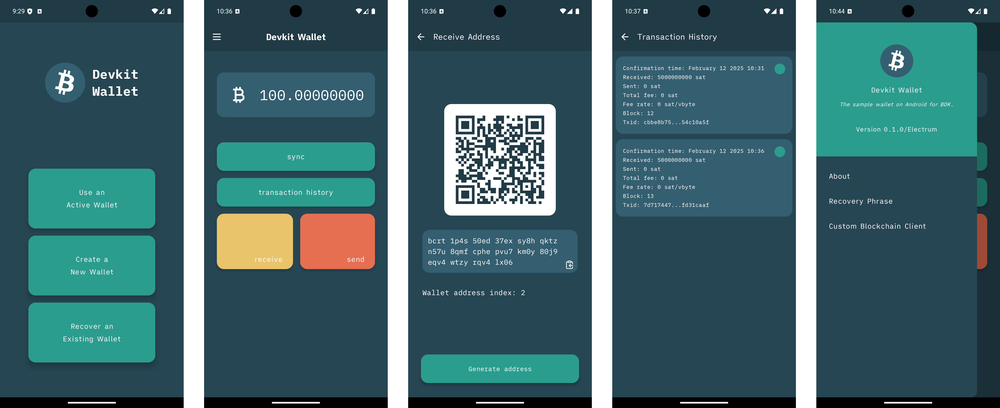

 # Bitcoindevkit Android Example Wallet

    

The _Devkit Wallet_ is a wallet built as a reference app for the [bitcoindevkit](https://github.com/bitcoindevkit) on Android. It is a fork of the long-standing [Devkit Wallet](https://github.com/thunderbiscuit/devkit-wallet), a repository that hosts a series of apps (4) of increasing complexity aimed at showcasing the bitcoindevkit library for beginner and advanced Android developers. 

This demo app is a departure of the Devkit Wallet approach and is built with the following goals in mind:
1. Be a reference application for the bitcoindevkit API on Android.
2. Showcase some of the more advanced features of the bitcoindevkit library.

## Feature list
- [x] Receive
- [x] Send
- [x] Sync wallet using Electrum
- [x] Retrieve transaction history
- [x] Wallet recovery using BIP39 recovery phrases
- [x] Send to multiple recipients
- [x] "Send All" functionality
- [x] Choose custom Electrum server
- [x] Create OP_RETURN outputs
